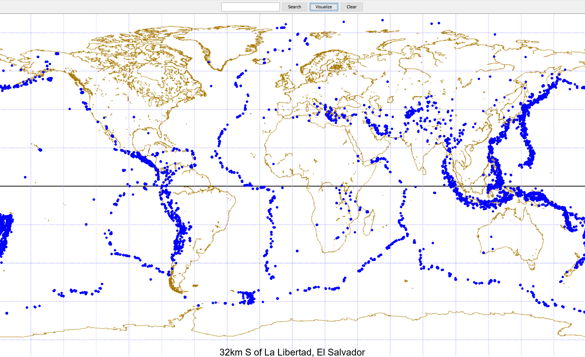
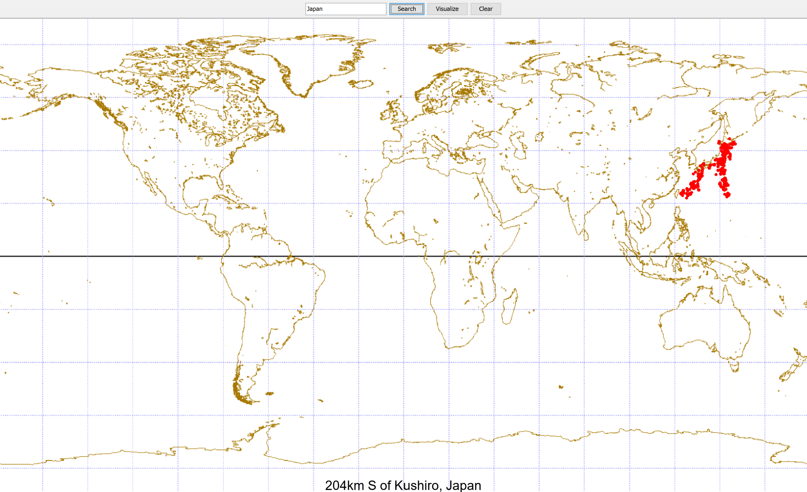

# SeismicDataVisualizer
Data visualization program mapping major earthquakes from 2018. Three class implementations w/ main code found in Earthquake.java, EarthquakeDataBase.java, and Visualization.java

 \\

